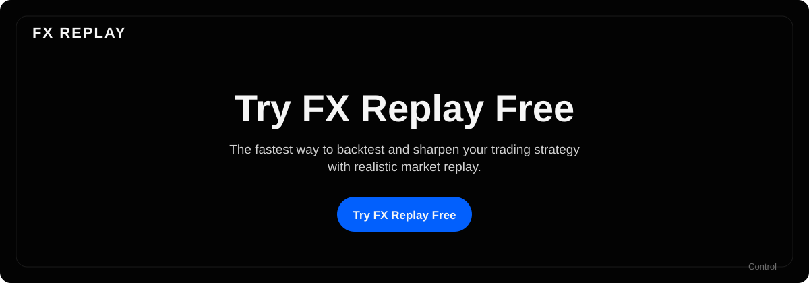

# FX Replay — "Try FX Replay Free" Landing

A small, production-oriented landing experience for the FX Replay growth engineering
challenge: a marketing landing page, a real signup flow backed by a Users API, an
SSR-resolved A/B test with zero layout flicker, and an analytics funnel instrumented
from day one.

## 1. Working Implementation

- **Repo:** https://github.com/fonko/fxreplay
- **Live deployment:** https://fxreplay.alfonsopayra.me (also reachable at the Vercel-assigned
  domain, https://fxreplay-seven.vercel.app)
- **Local setup:**
  ```bash
  npm install
  cp .env.example .env   # fill in Supabase/PostHog/admin values, see comments in the file
  npm run dev            # http://localhost:4321
  ```
  Database schema changes go through Drizzle:
  ```bash
  npm run db:generate    # writes SQL under drizzle/
  npm run db:migrate     # applies it to DATABASE_URL
  ```

## 2. Architecture Overview

**Stack:** Astro 5 (SSR, `@astrojs/vercel` adapter) + Tailwind v4/shadcn/ui + Astro Actions
(Zod-validated) + Drizzle ORM + Supabase Postgres + PostHog (`posthog-js` client,
`posthog-node` server). Full rationale and hard constraints live in [CLAUDE.md](CLAUDE.md).

**Rendering:** everything is static server-rendered HTML except the signup form
(`SignupForm.tsx`, hydrated with `client:idle`) — the only client JS on the page. Hero
copy, features, social proof, and footer are plain `.astro` components with zero
hydration cost.

**A/B flag resolution:** [src/middleware.ts](src/middleware.ts) runs on every request,
assigns/reads a `ph_distinct_id` cookie, and calls `posthog-node`'s `evaluateFlags` for
the `hero-variant` flag *before* rendering. The resolved variant is passed to
[Hero.astro](src/components/sections/Hero.astro) as server data — the client never
re-decides or repaints the variant, so there's no flicker and no client-side flag
network call blocking first paint. If PostHog is unreachable, the flag evaluation
fails open to `"control"` ([middleware.ts:39](src/middleware.ts)) rather than blocking
the render.

**Users API:** implemented as Astro Actions rather than a separate REST layer, per the
stack decision in CLAUDE.md (Actions are Astro's typed, Zod-validated server-function
convention and already do a real HTTP round trip under the hood).
- [`src/lib/users/service.ts`](src/lib/users/service.ts) — the actual Drizzle
  queries (`createUser`, `updateUser`, `listUsers`), independent of the transport.
- [`src/actions/users.ts`](src/actions/users.ts) — `users.create` / `users.update` /
  `users.list`, each with its own Zod input contract.
- [`src/actions/signup.ts`](src/actions/signup.ts) — the public signup flow calls the
  *same* `createUser` function `users.create` uses, so persistence is one code path,
  not a duplicated one-off insert.
- `create` is public (it's what the signup form calls). `update`/`list` return PII
  (email, name) and there's intentionally no end-user auth system for this challenge, so
  they're gated behind a shared `ADMIN_API_KEY` header instead of being left open.
- [`src/pages/admin/users.astro`](src/pages/admin/users.astro) — a small `noindex`
  admin panel (list + inline rename + delete, each behind their own confirm/undo step)
  that exercises `update`/`list`/`delete` from the browser, so the contract isn't only
  provable via curl. [`src/actions/admin.ts`](src/actions/admin.ts) exchanges the same
  `ADMIN_API_KEY` for an httpOnly `admin_session` cookie on login (`assertAdmin` in
  `users.ts` accepts either the header or that cookie) — no server-side session store,
  so it stays correct across Vercel's stateless function invocations.

**UTM attribution:** [`src/middleware.ts`](src/middleware.ts) reads `utm_source`/
`utm_medium`/`utm_campaign`/`utm_content`/`utm_term` off the landing request's query
string and drops them in a `ph_utm` cookie — but only if that cookie doesn't already
exist, so a later visit with no query params (a direct return to finish signing up)
never overwrites the campaign that actually brought them (first-touch, not last-touch).
`signup.ts` reads that cookie and persists the values onto the new `leads` row, and the
admin panel lists Source/Medium/Campaign per user. This is separate from — and doesn't
depend on — PostHog's own automatic UTM capture on `$pageview`/person properties: this
path guarantees the attribution sits next to the user record in Postgres rather than
requiring a live PostHog query to reconstruct it.

**Identity merge (anonymous → identified):** the project mints one stable `distinct_id`
server-side at first touch ([middleware.ts](src/middleware.ts)'s `ph_distinct_id`
cookie) and reuses it everywhere — PostHog's own recommended "golden path" alternative
to Segment's classic anonymous-ID-then-`identify()` flow. On top of that,
[`SignupForm.tsx`](src/components/sections/SignupForm.tsx) now also calls
`posthog.identify(userId, { email, name })` client-side on a successful signup, using
our own database id as the new distinct_id. Verified via HogQL against the live
project: the resulting person shows `is_identified = true`, and its full event history
includes every `landing_page_viewed` from before that signup — the same "merge the
anonymous journey into the now-known user" behavior Segment does, just via PostHog's
own merge mechanism rather than a third-party CDP.

**Admin panel: per-user funnel data.** Two tiers, both live in
[`AdminUsersPanel.tsx`](src/components/admin/AdminUsersPanel.tsx):
- **Cheap (Postgres columns, no external call):** `variantId` (already existed),
  plus two new snapshot columns taken at signup time from cookies
  [middleware.ts](src/middleware.ts) already maintains — `visitCount` (from
  `ph_visit_count`, incremented on every real `GET /` — i.e. how many times this
  browser showed up anonymously before converting) and `conversionTimeSeconds`
  (same math already used for the `account_created` PostHog property, just also
  persisted). Shown as plain table columns.
- **Complete (live PostHog query, on demand):** the actual event-by-event funnel
  only lives in PostHog, not Postgres. Clicking a row's expand chevron calls the new
  `users.timeline` action → [`src/lib/posthog/query.ts`](src/lib/posthog/query.ts),
  which runs a HogQL query against PostHog's Query API (`POSTHOG_APP_HOST` +
  `POSTHOG_PROJECT_ID`, a personal API key with the **Query Read** scope) for that
  person's full merged history — every anonymous `landing_page_viewed` through
  `$identify`. Looked up by `person_id` (not `distinct_id` alone), since only
  `person_id` spans both the pre- and post-`identify()` distinct_ids. Fetched lazily
  per row, not on page load, since it's a real external round trip per user.

**Email confirmation (magic link):** after `createUser` succeeds (including on a
repeat signup — doubles as "resend the link"), `signup.ts` issues a single-use token
via [`src/lib/magic-link/service.ts`](src/lib/magic-link/service.ts) and emails it
through a DreamHost SMTP mailbox (`nodemailer`, see [`src/lib/email/client.ts`](src/lib/email/client.ts)).
- Only the token's SHA-256 hash is stored (`magic_links.token_hash`) — a DB read never
  hands out a usable link. Tokens expire after 30 minutes and are marked used on the
  first successful confirm, so replaying an old link fails.
- [`src/pages/auth/confirm.astro`](src/pages/auth/confirm.astro) consumes the token
  (plain SSR `GET`, not an Action — email clicks are navigations, not RPC calls), sets
  `leads.email_verified_at`, and drops an httpOnly `user_session` cookie (the row's own
  id — no separate session store, same stateless-Vercel reasoning as `admin_session`)
  before redirecting to [`/dashboard`](src/pages/dashboard.astro), a placeholder
  "Welcome" page gated on that cookie.
- **Trade-off:** the email send is `await`ed inside the signup action, so the response
  (and the form's "Creating your account…" state) blocks on a real SMTP round trip
  (~2-5s observed) rather than returning immediately. Chose correctness over shaving
  that latency — deferring it (e.g. Vercel's `waitUntil`) risks the function freezing
  before the email actually sends, and this challenge doesn't have telemetry to verify
  a background path reliably completes. A failed send is caught and reported via
  PostHog (`source: "magic_link_email"`) rather than failing the signup itself — the
  account still gets created either way.
- New env vars (`.env.example`): `SMTP_HOST`, `SMTP_PORT`, `SMTP_USER`, `SMTP_PASS`,
  `EMAIL_FROM`.

**Persistence trade-offs:**
- Table is named `leads` (pre-existing from an earlier scaffold) and serves as the
  Users API's backing store — didn't rename it, not worth the churn for a take-home.
- `DATABASE_URL` uses Supabase's **Transaction pooler** (Supavisor, port 6543), not the
  direct connection (port 5432) — the direct connection is IPv6-only and Vercel's
  functions run on IPv4, so the direct URL resolves to `ENOTFOUND` in production (hit
  this for real during the build — see §6).
- RLS is enabled on `leads` with **no policies** ([drizzle/0000_uneven_jazinda.sql](drizzle/0000_uneven_jazinda.sql)).
  The app writes via `DATABASE_URL` (a direct Postgres role that bypasses RLS by
  design), so RLS's actual job here is blocking Supabase's auto-generated PostgREST
  Data API from exposing `leads` to the public `anon` key.
- Signup is idempotent by email: resubmitting an existing email returns the existing
  row (`alreadyExisted: true`) instead of erroring or duplicating — and doesn't re-fire
  `account_created`, so retries can't inflate the conversion metric.

**Infrastructure:**
- **Hosting/Deploy:** Vercel, connected to `main` via its GitHub integration — every
  push builds and deploys automatically (no manual `vercel` CLI step in the loop).
- **CI:** [.github/workflows/ci.yml](.github/workflows/ci.yml) runs `astro check` +
  `astro build` on every push/PR, independent of Vercel's own build — a genuine gate,
  not just "Vercel happened not to fail."
- **DNS/CDN:** custom subdomain (`fxreplay.alfonsopayra.me`) via a CNAME at the
  registrar pointing to Vercel's edge network; Vercel's global CDN serves the static
  output and edges the SSR function.
- **Observability:** PostHog Error Tracking — server-side exceptions in the signup and
  Users API actions are reported via `captureExceptionImmediate` (see §6), not just
  logged to Vercel's function logs where nobody's watching.
- **Security:** RLS as above; admin-gated Users API mutations; `SUPABASE_SERVICE_ROLE_KEY`
  and `DATABASE_URL` are server-only env vars, never imported into client-hydrated code.

## 3. Analytics Plan

Taxonomy (also in [src/lib/posthog/events.ts](src/lib/posthog/events.ts), kept in sync
with this table):

| Event | Trigger | Key properties | Funnel stage |
|---|---|---|---|
| `landing_page_viewed` | Initial page load | `referrer`, `utm_source`, `variant_id`, `device_type` | Entry |
| `cta_clicked` | Click on the primary CTA | `cta_location`, `button_text`, `variant_id` | Intent |
| `signup_form_started` | First focus on a form field | `field_name`, `time_to_interaction` | Intermediate 1 |
| `signup_form_submitted` | Form submitted (success or failure) | `validation_success`, `error_code?` | Intermediate 2 |
| `account_created` | Successful Users API response | `user_id`, `variant_id`, `conversion_time_seconds` | **Primary conversion** |

**Primary metric — CVR:** unique users who fire `account_created` ÷ unique users who
fire `landing_page_viewed`, both windowed by `distinct_id`.

**Tooling:** PostHog end-to-end — `posthog-js` client-side, `posthog-node` server-side
for both flag evaluation and the `account_created`/exception events, so control and
variant traffic, feature flags, funnels, and error tracking all live in one project
instead of stitching together GA4 + a separate flagging tool.

**Data quality, concretely (not just "we'd validate it"):**
- **One `distinct_id` across client and server.** Middleware sets `ph_distinct_id` as a
  cookie; the client SDK is bootstrapped with that same ID
  ([Layout.astro:46-49](src/layouts/Layout.astro)) instead of generating its own —
  otherwise server-fired `account_created` and client-fired funnel events would land on
  two different identities and the funnel just wouldn't connect.
- **`variant_id` is server-decided, not client-guessed**, and threaded through every
  event via `data-cta-variant` / hidden form fields — no risk of the client
  mis-attributing an event to the wrong arm of the experiment.
- **`device_type` (mobile/tablet/desktop) is a PostHog *person* property, not just an
  event property on `landing_page_viewed`** — set via `$set` on that first capture
  ([client.ts](src/lib/posthog/client.ts)). The brief calls out session/user context per
  event, and the one piece of context most worth breaking a growth experiment down by
  is device: mobile and desktop traffic convert differently often enough that treating
  them as one pool understates what's actually working. Because it's a person property
  keyed by the same `distinct_id` the client and server share, it's available for
  breakdown on *every* event in the funnel — including `account_created`, which fires
  server-side via `posthog-node` and never sees `window.innerWidth` itself. The
  experiment's funnel metric (§4) can be broken down by `device_type` in PostHog to see
  whether the hero copy test wins on both, or only one.
- **No double-counting conversions:** a repeat signup with the same email returns
  `alreadyExisted: true` and skips `account_created` entirely (see §2).
- **`conversion_time_seconds` is real, not a placeholder:** a `ph_first_seen_at` cookie
  set on first visit ([middleware.ts](src/middleware.ts)) lets `signup.ts` compute actual
  elapsed time instead of always sending `null`.
- **Failures are distinguishable from successes in the funnel data itself**
  (`validation_success`/`error_code` on `signup_form_submitted`) *and* surfaced
  separately as exceptions in PostHog Error Tracking — verified live: a production
  misconfiguration (see §6) initially caused a string of failed `cta_clicked` →
  `signup_form_submitted` events with no matching `account_created`, and was only
  caught by reading those properties, which is exactly why the exception-tracking hook
  was added afterward.

## 4. Experiment Proposal

**Status: live**, not just proposed — a PostHog Experiment on the `hero-variant` flag
is running in production. Verified end-to-end after launch: evaluating the flag across
20 simulated `distinct_id`s split 9 control / 11 test (real ~50/50 traffic allocation,
no fallback leakage), and the live site serves the "test" headline for its own visitor
cookie. Primary metric is a Funnel (`landing_page_viewed` → `account_created`);
secondary is a Mean metric on `cta_clicked` total count — PostHog's current metric
types (`Funnel`/`Mean`/`Ratio`/`Retention`) rather than the "Trend" naming used below,
which is what this was originally scoped against.

| Control | Test |
|---|---|
|  |  |

- **Hypothesis:** the control headline ("Try FX Replay Free") just repeats the CTA and
  doesn't say what the product actually does. A benefit-led headline that names the
  concrete action ("Trade Smarter. Backtest Instantly.") will convert better because it
  gives a visitor a reason to act, not just an instruction.
- **Control:** current default copy — "Try FX Replay Free" / "The fastest way to
  backtest and sharpen your trading strategy with realistic market replay."
- **Variant:** `hero-variant = "test"` — "Trade Smarter. Backtest Instantly." / "Replay
  any market, any timeframe, at your own pace — and turn hindsight into your edge."
  (already implemented in [Hero.astro](src/components/sections/Hero.astro), gated by the
  PostHog flag).
- **Success metric:** CVR per variant (`account_created` ÷ `landing_page_viewed`),
  computed as a PostHog experiment/funnel breakdown by `variant_id`. `cta_clicked`
  rate is tracked as a secondary/diagnostic metric to tell a "more clicks, same signups"
  story apart from a "more signups" one.
- **Decision criteria:**
  - **Launch the variant** if it reaches statistical significance (PostHog's built-in
    significance calc, ~95% confidence) with a positive CVR lift, after a pre-registered
    minimum sample size per arm (avoids peeking-driven false positives).
  - **Keep running** if the trend is directionally positive but underpowered — don't
    call it early just because the challenge timebox is short.
  - **Reject the variant** if it's flat or negative at significance, or if it lifts
    `cta_clicked` without lifting `account_created` (a sign the new copy attracts clicks
    that don't convert — a real risk worth checking for, not just theoretical).

## 5. AI-Native Workflow

- **Project-level instructions:** [CLAUDE.md](CLAUDE.md) — stack matrix, hard rules
  (zero-JS-by-default hydration, SSR-only flag evaluation, RLS, Zod on every Action),
  and the analytics taxonomy table this doc's §3 mirrors.
- **Reusable workflow:** [`/growth-audit`](.claude/commands/growth-audit.md) — a
  standing checklist command that runs the three specialized agents below against
  hydration directives, SEO/metadata, and A/B-flag/event-schema correctness, and
  [`brand-kit`](.claude/commands/brand-kit.md) for the design-token/brand rules.
- **Agents** (`.claude/agents/`): `performance-agent` (hydration/TTFB/bundle),
  `seo-agent` (metadata/semantic HTML/structured data), `growth-experimentation-agent`
  (SSR flag correctness, event schema, `distinct_id` consistency) — each with a
  narrow, single-purpose brief rather than one do-everything agent.
- **MCP:** Supabase MCP configured for schema/migration inspection (project-scoped,
  `.mcp.json`); Context7 for up-to-date library docs during implementation; Vercel MCP
  added for deployment/env-var management (requires the user's own OAuth login to
  activate — documented rather than force-completed, since that's a credential step
  only the account owner can do).
- **Human judgment — what was delegated vs. driven by hand**, concretely from this
  build (not a hypothetical):
  - *Delegated:* CRUD action boilerplate, Drizzle migration generation, the CI workflow
    file, this README's drafting.
  - *Corrected after AI output was wrong or incomplete:* the AI's first migration
    left RLS as a comment instead of an actual policy — added explicitly and verified
    with a direct query (`relrowsecurity = true`) rather than trusting the migration ran
    silently correct.
  - *Root-caused by a human reading production logs, not guessed at:* the
    `DATABASE_URL` outage (§6) was diagnosed by first noticing the swallowed error
    was invisible in Vercel's logs, fixing the logging gap, re-triggering the failure,
    and reading the actual `ENOTFOUND db.…supabase.co` stack trace — the AI's first two
    guesses (missing env vars, then a stale value) were checked against real evidence
    before landing on the actual cause.
  - *A judgment call to push back on:* the GitHub Actions "account locked" error looked
    at first like a project misconfiguration; it was verified against public GitHub
    Community discussions before concluding it was a platform-side billing bug, not
    something to keep debugging locally.

## 6. Performance Review

- **Hydration:** two hydrated islands (`SignupForm`, `NavMenu` — both `client:idle`),
  everything else (Hero, Features, SocialProof, Footer, NavBar's logo/layout) ships as
  static HTML with zero client JS.
- **Rendering strategy:** SSR per request (not static prerender), required for the
  server-decided A/B flag and cookie-based identity; kept cheap by evaluating exactly
  one flag key per request and failing open instead of blocking on PostHog latency.
- **Assets:** no raster images in the hero/above-the-fold content (text + one CTA), so
  there's no LCP-critical image to optimize or size explicitly — the logo in the header
  is a small inline SVG.
- **Accessibility** — checked directly (heading structure, images, focus order), not
  just asserted:
  - Heading hierarchy is sequential with no skipped levels (`h1` → `h2` → `h2`), every
    `` has `alt` (decorative ones use `alt=""` + `aria-hidden`), and `<html lang="en">`
    is set.
  - All interactive elements are real `<button>`/`<a>` tags (never a `<div onClick>`), so
    they're keyboard-reachable and activate on Enter/Space by default — verified the tab
    order reaches the logo, then Features, then Get Started, in that sequence, with a
    visible focus ring (the shared `Button` component's `focus-visible:ring-3`).
  - Found and fixed a real mismatch during this check: the Features dropdown's items were
    marked `role="menuitem"` (ARIA menu semantics — arrow-key navigation, activatable
    commands) but are static, non-interactive descriptions. Switched the trigger/panel to
    the plain disclosure pattern (`aria-expanded` + `aria-controls`, no `aria-haspopup`)
    instead of mislabeling inert content as a command menu.
  - The signup form's error state uses `role="alert"` and the success state `role="status"`
    so screen readers announce both without the user needing to re-find the form.
  - Not done: no full screen-reader pass (VoiceOver/NVDA) and no automated axe-core/
    Lighthouse accessibility score — the checks above are real but manual, not exhaustive.
- **Fixed from a real Lighthouse audit, not just theory** — ran the live site through
  PageSpeed Insights mid-build and found two concrete issues, both fixed and re-verified
  against the production build output:
  - *Render-blocking CSS:* the ~20KB bundle was over Astro's 4KB auto-inline threshold,
    so it shipped as a blocking `<link>` (~230ms). Set `build.inlineStylesheets: 'always'`
    in [astro.config.mjs](astro.config.mjs) — for a one-page site there's no route-level
    CSS to lose by inlining everything. Confirmed in the built output: `"styles":[{"type":"inline",...}]`,
    zero separate `.css` files in `.vercel/output`.
  - *Critical request chain (4.4s max latency):* `Layout.astro`'s PostHog init used a
    static `import`, which pulls `posthog-js` (~90KB) into the page's build graph — Vite
    then eagerly `modulepreload`s it in `<head>`, competing with actually-critical
    resources even though the script itself deferred execution. Switched to a dynamic
    `import()` ([Layout.astro](src/layouts/Layout.astro)), which Vite does *not* preload;
    confirmed in the built server chunk that the route's `scripts` metadata (Astro's
    auto-preload list) no longer references it at all.
  - *Duplicated JS within the posthog-js bundle* (`preact`, `uuidv7`, `surveys.js`,
    `conversations.js` all flagged by Lighthouse's duplicate-JS audit): the default
    `posthog-js` entry bundles Session Replay, Surveys, and Conversations, none of which
    this landing page calls — those products being off in the PostHog project doesn't
    stop the client bundle from shipping their code, only from activating it. Switched
    [client.ts](src/lib/posthog/client.ts) to the `posthog-js/dist/module.slim` entry,
    which cuts the built chunk from ~300KB to 141KB minified (confirmed in
    `.vercel/output/static/_astro/`) while keeping everything actually used
    (`init`/`capture` with bootstrapped flags) — reverified `landing_page_viewed` and
    `cta_clicked` still fire correctly after the swap.
- **Third-party scripts:** a single, now genuinely deferred `posthog-js` (slim build)
  init; no other third-party tags.
- **SEO — structured data & sitemap:** `Organization` + `WebSite` + `SoftwareApplication`
  JSON-LD ([Layout.astro](src/layouts/Layout.astro)) alongside the existing OG/Twitter/
  canonical tags — only asserting what's actually true (a real free tier), no fabricated
  ratings/review counts. `@astrojs/sitemap` generates `sitemap-index.xml` at build time
  (linked from `robots.txt`); with a single route it's a one-URL sitemap, which is the
  honest size for a one-page site — not padded out for appearance.
- **Known gaps, honestly, not glossed over:**
  - No explicit cache-control headers beyond Vercel's defaults — fine at current scale,
    worth revisiting with real traffic.
  - No rate limiting on the public `signup` action — a real production risk (spam
    signups, cost from repeated Postgres/PostHog calls) that a 6-hour scope didn't
    leave room for; next step would be a per-IP/per-distinct_id limit at the edge.
- **A production incident this session, and what it says about readiness:** the
  Postgres connection string in Vercel pointed at Supabase's IPv6-only direct endpoint,
  which silently `ENOTFOUND`'d on every signup in production until caught. Two concrete
  fixes came out of it, both already shipped: (1) the actual exception is now logged
  server-side instead of being swallowed into a generic message, and (2) it's also
  reported to PostHog Error Tracking, so the next class of outage surfaces as an alert
  instead of a string of silently-failed `signup_form_submitted` events someone has to
  notice by eye.
